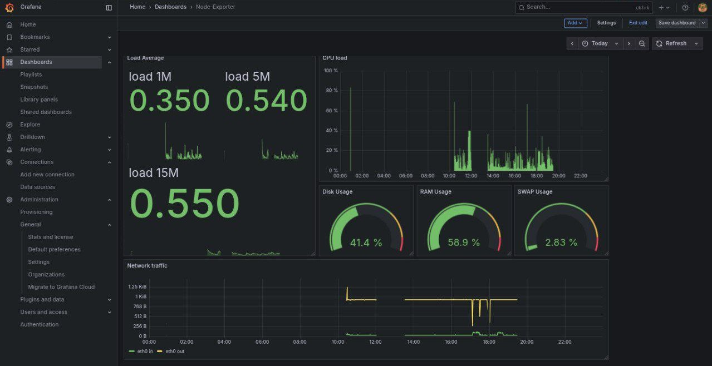
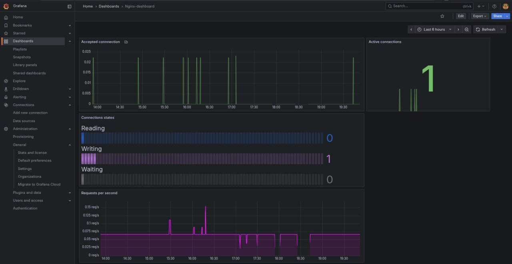

**🇺🇸 [English Version](README.md)** | **🇷🇺 Русский**

# 🚀 Monitron

Персональный стек мониторинга для разработчиков и DevOps инженеров.

Monitron — это готовый к использованию стек мониторинга, который позволяет собирать, анализировать и визуализировать метрики приложений и инфраструктуры.
Идеален для пет-проектов, домашних лабораторий и обучения DevOps-практикам.

---

## ✨ Возможности

- 📊 Сбор метрик — Prometheus для хранения временных рядов  
- 📈 Визуализация — Grafana с преднастроенными дашбордами  
- 🚨 Алертинг — Alertmanager с поддержкой уведомлений в Telegram  
- 🖥 Мониторинг системы — Node Exporter для метрик хоста  
- 🌐 Веб-мониторинг — Nginx + Exporter  
- 🔄 CI/CD — автоматическая проверка конфигураций и сборки  

---

## 🛠 Технологии

| Компонент | Версия | Назначение |
|------------|---------|-------------|
| Prometheus | 2.48 | Сбор и хранение метрик |
| Grafana | 10.2 | Визуализация данных |
| Alertmanager | — | Управление уведомлениями |
| Node Exporter | — | Метрики хоста |
| Docker Compose | 2.15 | Оркестрация контейнеров |
| GitHub Actions | — | CI/CD пайплайн |

---

## 🚀 Быстрый старт

---

### Установка и запуск

```bash
# 1. Клонируем репозиторий
git clone https://github.com/DanLinX2004X/monitron.git
cd monitron

# 2. Создаём .env из шаблона
cp .env.example .env

# 3. Запускаем стек мониторинга
docker compose up -d --build

# 4. Проверяем состояние
docker compose ps
```


---

## 🔗 Доступ к сервисам

Сервис URL Логин

Grafana http://localhost:3000 admin / admin

Prometheus http://localhost:9090

Alertmanager http://localhost:9093

Nginx http://localhost:8080

P.S. Для входа в Grafana требуется логин и пароль. При первом открытии там буде admin/admin (логин и пароль совпадают), после этого Grafana попросит поменять пароль.

---

## 📦 Остановка сервисов

```
docker compose down
```

---

## ⚙️ Alertmanager и Telegram уведомления

Файл .env.example содержит переменные для интеграции с Telegram-ботом:

```text
TELEGRAM_BOT_TOKEN=
TELEGRAM_CHAT_ID=
```

После заполнения .env, Alertmanager будет автоматически отправлять уведомления о срабатывании алертов в Telegram.


---
## 📊 Готовые дашборды Grafana

System Overview — CPU, RAM, диск, сеть

Nginx Analytics — запросы, соединения, ошибки

---

## 🏗 Архитектура проекта

```text
monitron/
├── 📁 prometheus/
│   ├── config/
│   │   ├── prometheus.yml       # Основная конфигурация
│   │   └── alert.rules.yml      # Правила алертов
│   └── data/                    # Хранилище временных рядов
├── 📁 grafana/
│   └── provisioning/            # Автоматическая настройка
├── 📁 nginx/
│   ├── html/
│   │   └── index.html           # Тестовая страница
│   └── nginx.conf               # Конфигурация веб-сервера
├── 📁 screenshots/              # Скриншоты Grafana / Prometheus
│   ├── system_dashboard.png
│   └── nginx_monitoring.png
├── 🐳 docker-compose.yml        # Оркестрация сервисов
├── 📜 .env.example              # Переменные окружения
├── 📘 README.md                 # Документация (RU)
└── 📘 README.en.md              # Документация (EN)
```

---

## 🔄 CI/CD Pipeline

Проект включает автоматическую проверку конфигураций через GitHub Actions:
✅ Проверка Docker Compose (docker compose config)

✅ Валидация Prometheus конфигурации (promtool check config)

✅ Health-check контейнеров

✅ Сборка и деплой


---

## ⚠️ Локальное тестирование (act)

Можно запускать пайплайн локально:

```bash
act -j validate
```
> ⚠️ Однако act имеет ограничения (network isolation, health-checks и т.д.).
Для надёжной проверки используйте настоящий GitHub Actions runner.


---

##  Скриншоты

System Dashboard



Nginx Monitoring



---

🤝 Участие в разработке

1. Форкните репозиторий


2. Создайте ветку: git checkout -b feature/amazing-feature


3. Сделайте коммит: git commit -m 'Add amazing feature'


4. Запушьте: git push origin feature/amazing-feature


5. Откройте Pull Request


---

📄 Лицензия

Распространяется под лицензией MIT.


---

👤 Автор

DanLinX2004X


